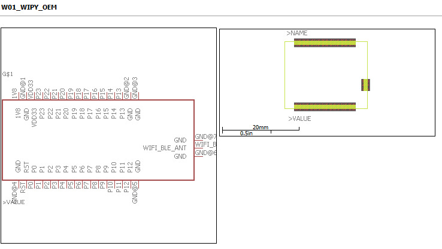
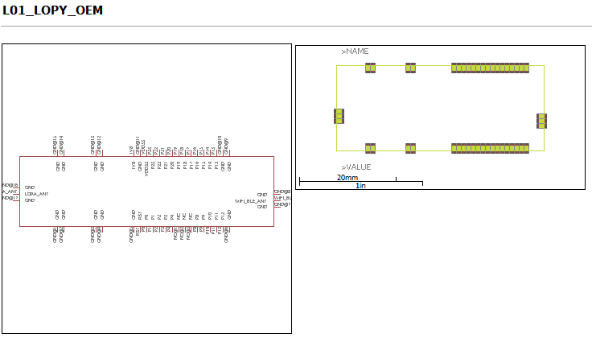

# Autodesk Eagle Libraries for Pycom Microchips

These Eagle libraries are based on the [Pycom drawings](https://github.com/pycom/pycom-documentation/tree/master/chapter/datasheets) for their OEM microchips.  Work in progress.

Check yourself that you are happy that the libraries match the Pycom specs and are fit for your purposes.

## W01 WiPy OEM Eagle Library
Download: [W01 WiPy OEM Library File](W01_WiPy_OEM.lbr)

## L01 LoPy OEM Eagle Library
Download: [L01 LoPy OEM Library File](L01_LoPy_OEM.lbr)
